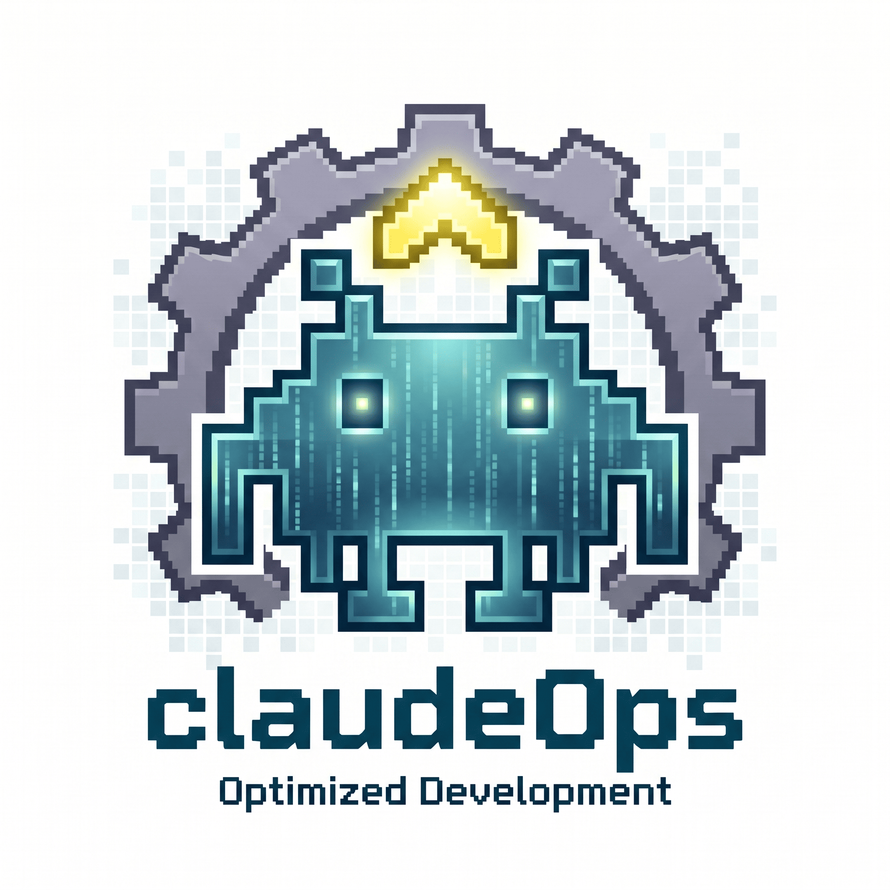

<p align="center">
  
  <h1 align="center">ClaudeOps</h1>
  <p align="center">
    <strong>Make Claude Code actually work like a senior engineer.</strong><br/>
    Drop-in agents, automatic token compression, safety hooks, and a UI design pipeline — one command to install.
  </p>
  <p align="center">
    <a href="https://www.npmjs.com/package/@elixpo/claudeOps.elixpo"></a>
    <a href="https://www.npmjs.com/package/@elixpo/claudeOps.elixpo"></a>
    <a href="https://github.com/elixpo/claudeOps.elixpo/stargazers"></a>
    <a href="LICENSE"></a>
    
  </p>
</p>

---

## The Problem

Claude Code is powerful, but out of the box it burns through tokens reading things it doesn't need, skips code review, writes orphan files nobody calls, and produces generic-looking UIs. You end up babysitting it.

ClaudeOps fixes that. It's a set of config files, agents, and hooks that drop into your Claude Code setup and make it work the way you'd expect a senior engineer to work — research before coding, review before merging, prove things work before saying "done."

---

<p align="center">
  
</p>

--- 


## Quick Start

```bash
npx @elixpo/claudeOps.elixpo init
```

That's it. The installer walks you through each component — nothing gets installed without your say-so.

**Other commands:**
```bash
npx @elixpo/claudeOps.elixpo status    # see what's installed
npx @elixpo/claudeOps.elixpo remove    # clean uninstall
```

**Flags:**
```bash
npx @elixpo/claudeOps.elixpo init --yes          # skip all prompts, install everything
npx @elixpo/claudeOps.elixpo init --agents-only  # only install the 15 agents
npx @elixpo/claudeOps.elixpo init --no-mcp       # skip MCP server setup
```

---

## What's Inside

### Agents

15 specialized agents that Claude auto-delegates to based on what you're doing. They live in `~/.claude/agents/` and cost zero tokens when they're not active.

**Security & Review**
| Agent | What it does |
|-------|-------------|
| `breaker` | Tries to break your code. Every issue comes with a concrete exploit, not a vague warning. |
| `red-team` | You tell it what security measures you added. It attacks those specific assumptions. |
| `refiner` | Multi-pass review: write, critique against 6 principles, rewrite, verify. Two modes — quick surgical or full systematic. |
| `prism` | 4 isolated review passes (security, performance, test coverage, correctness), each with blinders so nothing gets glossed over. |
| `test-auditor` | Catches fake tests — mocks that test nothing, assertions that always pass, happy-path-only coverage. |

**Planning & Design**
| Agent | What it does |
|-------|-------------|
| `architect` | System design and ADRs. Compares 3+ approaches before recommending. Never writes implementation code. |
| `brancher` | Forces exploration of multiple solutions before committing. Won't start coding until all branches are compared. |
| `questioner` | 6 mandatory questions before any code. Surfaces hidden assumptions and finds the simplest path. |
| `specwriter` | Interviews you through 5 rounds of questions, then produces a SPEC.md detailed enough for a fresh session to execute without follow-ups. |
| `judge` | Evaluates competing solutions through binary gates and weighted scoring. Picks a winner, never declares a tie. |

**Research & Integration**
| Agent | What it does |
|-------|-------------|
| `researcher` | 7 depth levels from `surface` (30 seconds) to `overkill` (unlimited). Launches parallel sub-agents at higher levels. |
| `fuzzer` | Property-based testing across 1000+ random inputs. Finds edge cases humans miss. |
| `wirer` | Verifies new code is actually wired into the running system. Catches the #1 AI coding failure: beautiful code that nothing calls. |

**UI & Frontend**
| Agent | What it does |
|-------|-------------|
| `ui-architect` | Auto-triggers on frontend tasks. Pulls from component libraries (shadcn, magicui, animotion) instead of writing from scratch. Handles responsive, dark mode, accessibility. |
| `design-critic` | Auto-runs after UI implementation. Scores visual quality 1-10 with specific fix suggestions. |

### Token Savings

These tools run automatically after setup — they intercept Claude's input and output and compress what doesn't need to be verbose.

| Tool | What it does | Savings |
|------|-------------|---------|
| [RTK](https://github.com/rtk-ai/rtk) | Compresses bash command output | 60-90% |
| [jCodeMunch](https://github.com/jgravelle/jcodemunch-mcp) | Lightweight code indexing via tree-sitter | 95%+ |
| [Context Mode](https://github.com/mksglu/context-mode) | Sandboxes tool outputs in SQLite instead of dumping them into context | 98% |
| [MCP Compressor](https://github.com/atlassian-labs/mcp-compressor) | Compresses MCP server responses | 70-95% |
| [Cozempic](https://github.com/Ruya-AI/cozempic) | Auto-prunes stale context at multiple thresholds | 30-70% |
| [Headroom](https://github.com/chopratejas/headroom) | AST-aware prompt compression | ~50% |
| [Serena](https://github.com/oraios/serena) | LSP-powered code navigation (40+ languages) | Significant |
| [Docfork](https://github.com/docfork/docfork) | 9000+ library docs served on demand | Moderate |

The installer asks before adding each one. Everything is optional.

### UI Component Libraries

If you do frontend work, ClaudeOps connects Claude to real component registries so it fetches production components instead of hallucinating them.

| Library | What you get |
|---------|-------------|
| [21st.dev Magic](https://github.com/21st-dev/magic-mcp) | AI-generated production components |
| [shadcn/ui](https://ui.shadcn.com/docs/registry/mcp) | Official registry, zero hallucinations |
| [Magic UI](https://magicui.design/docs/mcp) | 60+ animated components |
| [Animotion](https://animotion-mcp.github.io/) | 745 CSS animations, 9000 SVG icons |
| [Aceternity UI](https://github.com/rudra016/aceternityui-mcp) | 200+ cinematic and 3D components |
| [Glance](https://github.com/DebugBase/glance) | Browser screenshots — Claude sees what it built |

> 21st.dev needs a free API key from [21st.dev](https://21st.dev). The installer reminds you.

### Safety Hooks

These run deterministically on every session — no LLM involved, just bash and regex.

| What it catches | When |
|----------------|------|
| Secrets in prompts or files (AWS, GitHub, Stripe, SSH keys, JWTs, and more) | Before every prompt and file write |
| Destructive commands (`rm -rf`, `git reset --hard`, `DROP TABLE`, `git clean -f`, etc.) | Before every bash command |
| `--no-verify` on git commits | Before git commits |
| Commits to main/master | Before git commits (warning, not blocking) |
| Orphan files with zero import references | On file edits and session end |
| Stuck loops (3+ identical failures) | After bash commands |
| Session continuity | Writes HANDOVER.md on exit, reads it on next session start |

### Per-Project Setup

After the global install, each project just needs a `.claudeignore` file (a template is included) to keep Claude from reading `node_modules/`, `dist/`, and other noise. Code indexing happens automatically on first visit.

---

## How It Works

The approach is simple: use Claude Code's own extension points (agents, hooks, MCP servers, plugins) to make Claude behave better by default.

- **Agents over instructions** — a specialized agent that loads on-demand costs zero tokens when unused. A rule in CLAUDE.md costs tokens every single turn.
- **Hooks over suggestions** — a PreToolUse hook that blocks a destructive command is stronger than a polite instruction Claude might ignore.
- **Evidence over assertions** — every verification requires proof (test output, type checker results), not "this should work."
- **Autonomous over manual** — tools that intercept and optimize automatically beat workflows that depend on you remembering to invoke them.

---

## Uninstall

```bash
npx @elixpo/claudeOps.elixpo remove
```

Interactively removes agents, hooks, MCP servers, and plugins. Your non-ClaudeOps configuration is preserved.

---

## Contributing

PRs welcome. Areas where help is needed:

- New agents for specific domains (ML, mobile, embedded)
- Benchmarks comparing with/without ClaudeOps
- Platform-specific install improvements

## License

[MIT](LICENSE)

<p align="center">
  <sub>Built and maintained by <a href="https://github.com/elixpo">@elixpo</a></sub>
</p>

<picture>
  <source media="(prefers-color-scheme: dark)" srcset="https://raw.githubusercontent.com/elixpo/claudeOps.elixpo/output/github-contribution-grid-snake-dark.svg" />
  <source media="(prefers-color-scheme: light)" srcset="https://raw.githubusercontent.com/elixpo/claudeOps.elixpo/output/github-contribution-grid-snake.svg" />
  
</picture>


